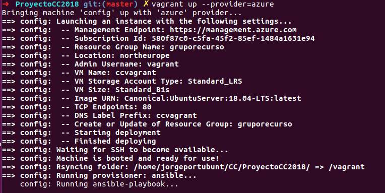
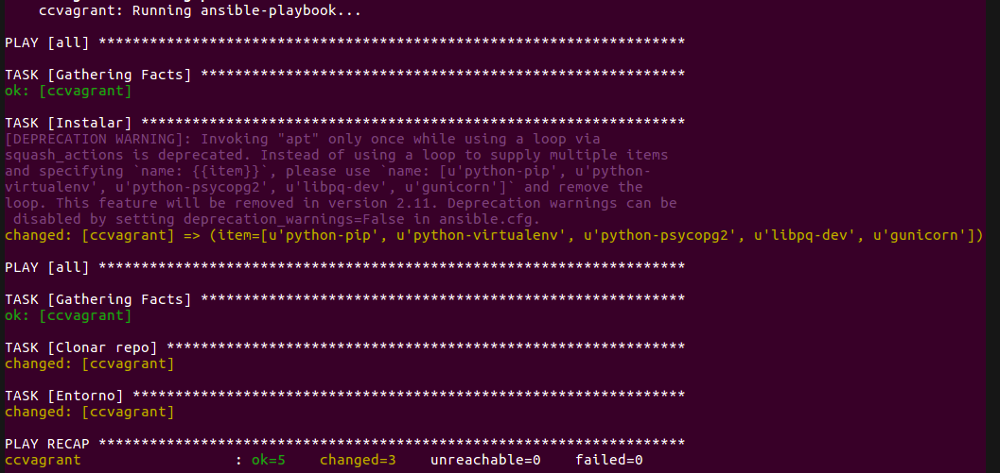

# Documentación del Hito 5

En este Hito se hace la orquestación con la herramienta Vagrant la cual es una generalización de herramientas como AzureCLI, permitiendo en teoría describir la infraestructura como código sin dependencia de los proveedores


## Vagrantfile

Es el documento donde se describe la infraestructura a desplegar.

La primer parte del código consiste en obtener las credenciales del entorno donde ejecutamos el Vagrant de esta manera evitamos robos de credenciales y al mismo tiempo permite que el vagrantfile sea ejecutado por diferentes usuarios sin necesidad de modificar el archivo

```
AZURE_TENANT_ID       = ENV['AZURE_TENANT_ID']
AZURE_CLIENT_ID       = ENV['AZURE_CLIENT_ID']
AZURE_CLIENT_SECRET   = ENV['AZURE_CLIENT_SECRET']
AZURE_SUBSCRIPTION_ID = ENV['AZURE_SUBSCRIPTION_ID']
```

Para poder hacer la conexión ssh se debe especificar la ruta de la llave, posterior a esto se envían los parámetros necesarios para desplegar la máquina.

```
ccvagrant.ssh.private_key_path = '~/.ssh/id_rsa'
 ccvagrant.vm.box = 'azure'
 ccvagrant.vm.define "ccvagrant" do |machine|

   machine.vm.provider :azure do |azure, override|
     azure.tenant_id       = AZURE_TENANT_ID
     azure.client_id       = AZURE_CLIENT_ID
     azure.client_secret   = AZURE_CLIENT_SECRET
     azure.subscription_id = AZURE_SUBSCRIPTION_ID
     azure.location                = 'westeurope'
     azure.vm_name                 = 'ccvagrant'
     azure.resource_group_name     = 'ccvagrant'
     azure.nsg_name                = 'ccvagrant'
     azure.vm_image_urn            = 'Canonical:UbuntuServer:18.04-LTS:latest'
     azure.vm_size                 = 'Standard_B1s'
     azure.vm_storage_account_type = 'Standard_LRS'
     azure.tcp_endpoints           = [22, 80]

   end
```

Para finalizar se provisiona las máquinas con ansible desde vagrant esta parte del código se usa para ubicar el documento de aprovisionamiento y también se puede usar para pasar parámetros a la ejecución como por ejemplo -vvv que se utiliza en vagrant para obtener mayor detalle de la ejecución, entre otros.
```
 ccvagrant.vm.provision "ansible" do |ansible|
     ansible.compatibility_mode = "2.0"
     ansible.playbook = 'playbook.yml'
 end
```

Se muestra el resultado de ejecutar el archivo Vagrantfile



En esta imagen podemos ver la ejecución del Playbook ordenada desde Vagrant



# Comprobación de la orquestación compañero @migueldgoncalves

Mi compañero hizo la comprobación de mi trabajo la cual está descrita en el siguiente documento
[Archivo](https://github.com/migueldgoncalves/CCproj_1819/blob/master/docs/Comprobacion_Hito5/comprobacion_provisionamiento_MiguelGoncalves_3.md)
