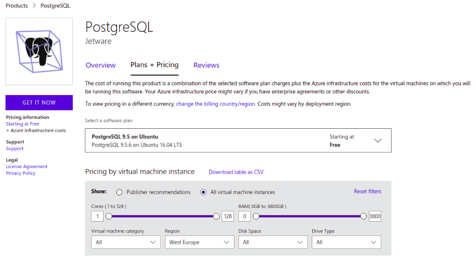
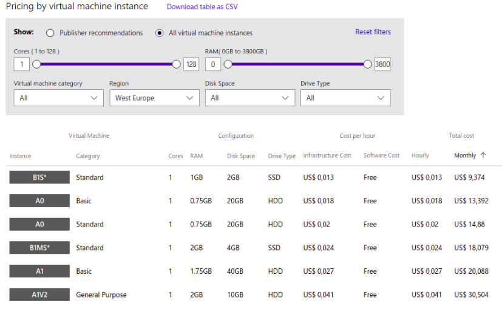
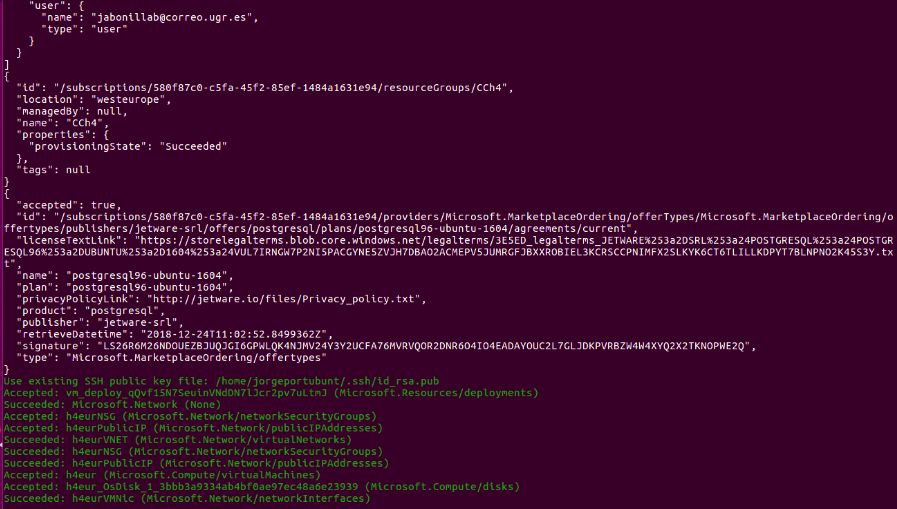
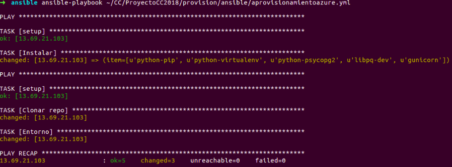

# Documentacion del Hito 4

En este hito se automatiza la creacion de la maquina virtual usando la herramienta de Azure CLI.


## Imagen

En azure la busqueda de la imagen se puede hacer por medio de [Azuremarketplace](https://azuremarketplace.microsoft.com/en-us/marketplace/apps/jetware-srl.postgresql?tab=PlansAndPrice)
esta es la unica imagen gratuita con PostgresSQL  y Ubuntu por eso es la que vamos a usar.



```
{
    "offer": "postgresql",
    "publisher": "jetware-srl",
    "sku": "postgresql96-ubuntu-1604",
    "urn": "jetware-srl:postgresql:postgresql96-ubuntu-1604:1.0.170503",
    "version": "1.0.170503"
  }

```

Dependiendo la region en nuestro caso West Europe el precio de la maquina puede variar, el proyecto funciona perfectamente con mas de 512 MB de ram por lo que se selecciona la mas economica


Resutado de ejecutar acopio.sh


```
1-az login
2-az vm image accept-terms
3-az group create
4-az vm create
5-az vm open-port

```

- 1- Se usa para autenticarce en azure
- 2- Se usa para aceptar terminos y condiciones de la imagen
- 3- Crear un grupo en azure
- 4- Crear la maquina virtual
- 5- Abrir los puertos de la maquina  
 
Resultado de ejecutar el playbook con ansible


