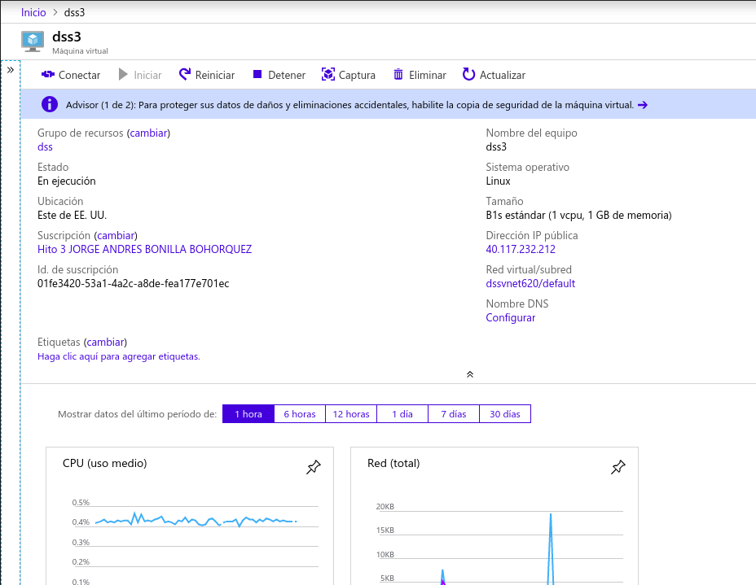
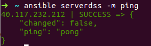
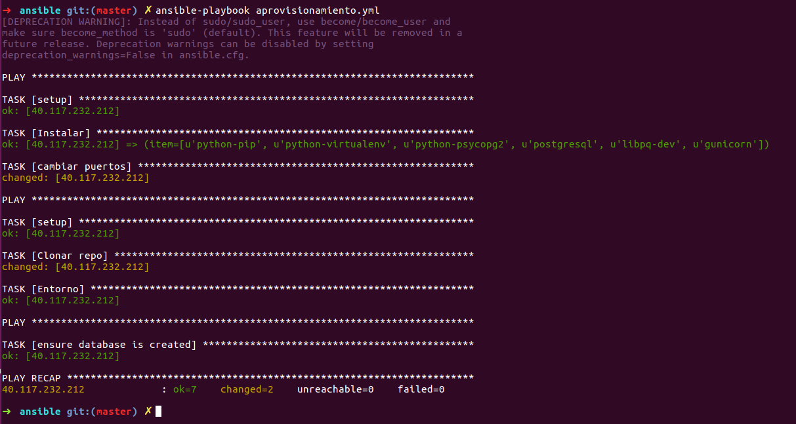
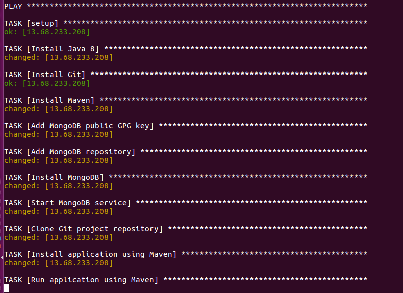

# Documentación del Hito 3

En este hito se ha desarrollado un script de aprovisionamiento en Ansible sobre una máquina virtual desplegada en Azure. También se ha añadido un pequeño servicio de logs a nuestra aplicación.

### Máquina Virtual

La máquina virtual usada en Azure tiene la siguiente configuración:

* SO: Ubuntu Server 18.04
* Región: EEUU.
* Autenticación: KEY
* Usuario: dss2018
* Dirección Ip: estática
* Puertos abiertos: SSH y HTTP


El sistema operativo es Ubuntu Server 18.04 dado que es la última versión de Ubuntu Server y porque tiene python instalado ya de fabrica, tambien git.



### Mejora de la aplicación

Se corrige la forma de ingresar productos al sistema ahora se hace por medio de un método PUT por medio de un json el elemento a crear
  
La configuración es la siguiente:
```
@app.route('/productos', methods=['GET','PUT', 'POST', 'DELETE'])
def productos():
   if request.method == 'GET':
       todo= Producto.query.all()
       resultado = []
       for item in todo:
           temp = item.__dict__
           del temp["_sa_instance_state"]
           resultado.append(temp)
       return json.dumps(resultado)
   elif request.method == 'PUT':
       producto = Producto(nombre=request.json['nombre'], ubicacion=request.json['ubicacion'])
       db.session.add(producto)
       db.session.commit()
       return "nuevousuario"
```

### Ansible

Ansible se ha utilizado para el aprovisionamiento. La razón de usar esta herramienta es que no hay que instalar ningún agente ni servidor extra.

Para usarlo, necesitamos instalarlo previamente. Después necesitamos editar un archivo llamado ansible_hosts y que se ubica en el directorio /etc/ansible/hosts. Este fichero debemos de editarlo con lo siguiente:

```
[serverdss]
40.83.167.147 ansible_user=dss2018
```
Con esto le estamos indicando que nuestra IP se encuentra en el grupo azure y tiene un usuario llamado dss2018. Ahora ejecutando el siguiente comando podemos hacer ping a nuestra máquina




El aprovisionamiento se hace de la siguiente manera

El fichero de aprovisionamiento se encuentra en el directorio provision con el nombre [aprovisionamiento.yml](././provision/ansible/aprovisionamiento.yml).

En resumen, este fichero sigue estos pasos:

* La instalación de los paquetes necesarios:
       - python-pip
       - python-virtualenv
       - python-psycopg2
       - postgresql
       - libpq-dev
       - gunicorn
      
* Redirección de puerto 80 al 5000
* Clonar repo
* Instalar dependencias en el entorno.
* Creación de la base de datos

Lanzamos el playbook y el resultado es el siguiente:




### Comprobación compañero

Se ha comprobado el funcionamiento del playbook de provisionamiento del compañero DE OLIVEIRA DIAS GONÇALVES, MIGUEL.

Se ha creado una máquina virtual siguiendo los pasos indicados en este [enlace](https://github.com/migueldgoncalves/CCproj_1819).

Se ha ejecutado el playbook de aprovisionamiento con este resultado:


